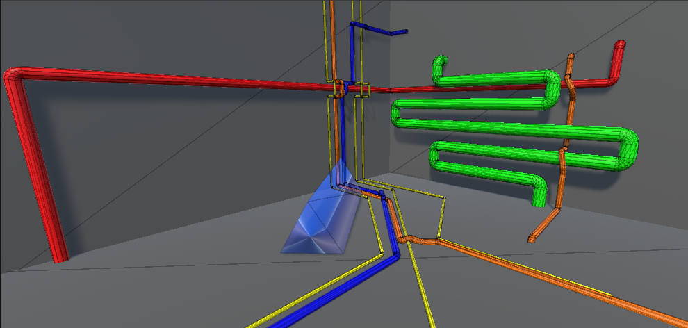
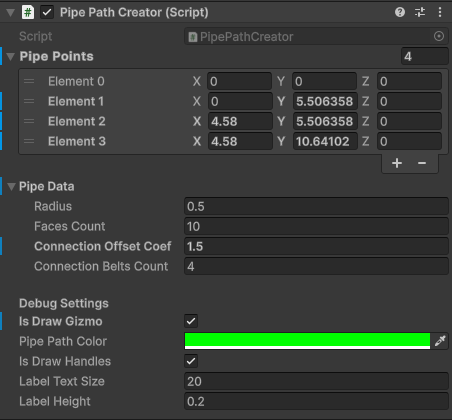
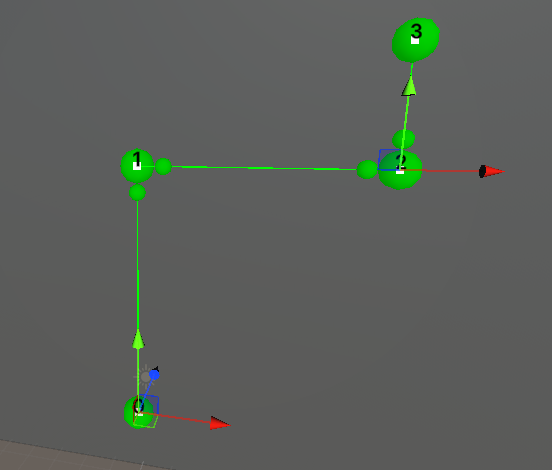
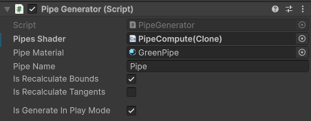
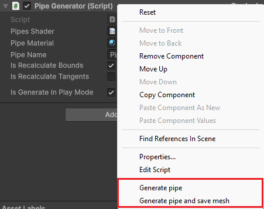
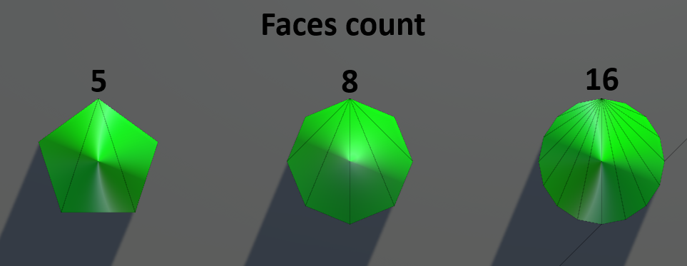
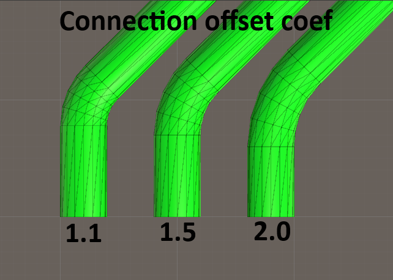
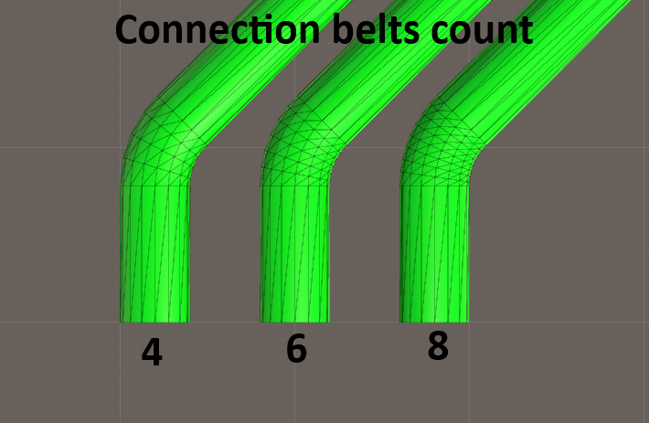

# PipeBuilderGPU



---

**PipeBuilder** позволяет процедурно создавать трубчатую геометрию как с помощью инструментов редактора (*PipePathCreator*, *PipeGenerator*) так и в процессе выполнения (*PipeBuilderGPU*), выполняя все математические вычисления параллельно на видеокарте с помощью вычислительных шейдеров. Такой подход позоляет значительно сократить время создания Mesh во время выполнения.

*PipeBuilderGPU* принимает в конструктор файл вычислительного шейдера *PipeCompute* и содержит единственный метод *Create*, принимающий список точек (путь прохождения трубы) и структуру с параметрами трубы *PipeData* (радиус, количество граней, коэффициент отступа соединительного сегмента, количество поясов соединительного сегмента), и возвращающий Mesh содержащий вершины, нормали и треугольники.

```c#
public Mesh Create(List<Vector3> points, PipeData pipeData)
```
```c#
[Serializable]
public struct PipeData
{
    [Min(0.001f)]
    public float radius;

    [Min(3)]
    public int facesCount;

    [Min(1.1f)]
    public float connectionOffsetCoef;

    [Min(3)]
    public int connectionBeltsCount;
}
```
При создании автоматически проведется валидация полученных данных на соответствие минимальным требованиям входных параметров. Также автоматически будут исключены дублирующиеся и коллинеарные точки. Если требуется построить только прямой сегмент трубы и используется всего 2 точки, алгоритм отработает быстрее, так как не будет использовать более сложные рассчеты для построения соединительных сегментов.

При построеннии не создаются лишние точки и скрытые полигоны на границах прямых и соединительных сегментов труб. Заглушки на концах труб формируются без создания дополнительных центральных вершин, поэтому содержат меньше треугольников. Все выделенные для вычислений буфферы автоматически освобождаются по завершению работы метода *Create* и его повторно можно вызывать с другими входными данными.

## PipePathCreator

Для создания геометрии труб в редакторе существуют всего 2 компонента, один из которых служит для построения пути:



Инструмент содержит список точек прохождения трубы, в локальных координатах, которые пересчитываются относительно самого GameObject, также здесь находится структура *PipeData* с параметрами трубы и ниже настройки отладки редактора.



Позиции точек можно изменять как с помощью списка в инспекторе, так и на сцене, кликнув по белому квадрату с номером точки. Выбранная точка включает встроенный инструмент изменения позции Unity. Каждое изменение можно отменить за счёт поддержки в редакторе команды Undo, так же Unity уведомит о несохранённых изменениях при выходе со сцены.

Размер точек соответствует настроенному радиусу. Точки поменьше показывают границы, где будут распологаться края соединительных сегментов в соответствии с настроенным коэффициентов отступа.

В настройках отладки можно включить/выключить отображение Gizmo и работу инструмента на сцене (включая активные точки и номера вершин над ними), настроить цвет Gismo, а также настроить размер отображаемых номеров точек на сцене и их высоту над позицией.

## PipeGenerator

Второй компонент служит для создания объекта с Mesh трубы, при нахождении на объекте требует наличия компонента *PipePathCreator* поэтому создаст его автоматически при отсутствии.



Здесь нужно указать ресурс вычислительного шейдера "PipeCompute", материал который применится к модели и имя создаваемого объекта. Также при создании можно указать нужно ли пересчитывать границы модели и тангенты. Последний параметр отвечает за то, нужно ли генерировать объект при в режмие выполнения. Этот параметр можно отключить, если компонент требуется для создания модели в редакторе.

Для создания объекта с моделью в редакторе нужно с помощью клика правой кнопки мыши открыть контекстное меню компонента и в появившемся списке внизу выбрать нужную опцию:



Можно просто создать объект трубы на сцене, либо создать и сохранить Mesh. Модель сохранится как *.asset* в корне папки ассетов и будет иметь заданное в компоненте имя, о чем будет отправлено сообщение в консоль Unity.

## Параметры создания трубы

Рассмотрим влияние параметров генерации на итоговую модель.

### FacesCount

Параметр позволяет задать количество граней трубы, что является её степенью сглаживания:



Минимальное количество граней - 3. Количество зависит от требуемой формы/гладкости модели.

### ConnectionOffsetCoef

Параметр влияет на то, насколько далеко от точки изгиба могут формироваться пояса полигонов соединения трубы:



Чем больше коэффициент отступа соединения трубы, тем плавнее получается её изгиб. Минимальное значение 1.1.

### ConnectionBeltsCount

Параметр влияет на количество поясов полигонов в соединительном сегменте трубы, степень сглаженности изгиба:



Чем больше поясов полигонов в соединении, тем плавнее выглядит изгиб. Минимальное количество 3. В каждом поясе количество полигонов равно удвоенному количеству граней.

---

Решение работает на любой дискретной видеокарте, а также при наличии DirectX 12.